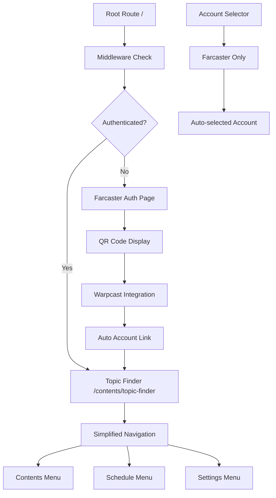

# Web3 Farcaster Integration Design Document

## Overview

This design document outlines the architectural changes needed to transform the existing social media management application into a Farcaster-focused web3 version. The design focuses on simplifying the user experience by removing traditional authentication methods and social platforms while maintaining the core content creation and scheduling functionality.

## Architecture

### High-Level Architecture Changes

The web3 branch will maintain the existing Next.js architecture with the following key modifications:

1. **Authentication Layer**: Replace email/Google OAuth with Farcaster-only authentication
2. **Routing Layer**: Implement direct routing to topic-finder, bypassing landing pages
3. **Platform Layer**: Filter out non-Farcaster platforms throughout the application
4. **Navigation Layer**: Simplify menu structure by hiding statistics and comments sections

### Component Architecture



## Components and Interfaces

### 1. Authentication System

#### Modified Components:
- **SignInClient.tsx**: Remove email/Google options, show only Farcaster authentication
- **authOptions.ts**: Maintain NextAuth structure but integrate Farcaster provider
- **middleware.ts**: Update redirect logic to point to topic-finder instead of landing page

#### New Interfaces:
```typescript
interface FarcasterAuthConfig {
  onlyFarcaster: boolean;
  autoRedirect: string; // '/contents/topic-finder'
  skipLanding: boolean;
}

interface FarcasterUser {
  fid: number;
  username: string;
  displayName?: string;
  pfpUrl?: string;
}
```

### 2. Platform Filtering System

#### Modified Components:
- **useSocialAccountStore.ts**: Filter PLATFORM_KEYS to include only 'farcaster'
- **Sidebar.tsx**: Hide platform options and show only Farcaster accounts
- **AccountSelectionModal**: Remove X and Threads connection options

#### Implementation Strategy:
```typescript
// Environment-based platform filtering
const PLATFORM_KEYS: PlatformKey[] = process.env.NEXT_PUBLIC_WEB3_MODE === 'true' 
  ? ['farcaster'] 
  : ['threads', 'x', 'farcaster'];

const PLATFORM_DISPLAY_NAMES: Record<PlatformKey, string> = {
  farcaster: 'Farcaster',
  // threads and x entries removed in web3 mode
};
```

### 3. Navigation System

#### Modified Components:
- **Sidebar.tsx**: Update navigation array to exclude statistics and comments
- **Dashboard Layout**: Maintain existing structure but filter menu items

#### Navigation Configuration:
```typescript
const navigation: NavItem[] = [
  {
    name: t('contentsCooker'),
    icon: FileEdit,
    isExpandable: true,
    subItems: [
      { name: t('topicFinder'), href: '/contents/topic-finder', icon: TrendingUp },
      { name: t('draft'), href: '/contents/draft', icon: FileText },
    ],
  },
  {
    name: t('schedule'),
    href: '/schedule',
    icon: Calendar,
  },
  // Statistics and Comments sections removed
];
```

### 4. Routing System

#### Modified Components:
- **page.tsx (root)**: Implement direct redirect logic
- **HomeClient.tsx**: Bypass landing page rendering in web3 mode
- **middleware.ts**: Update authentication flow to redirect to topic-finder

#### Routing Logic:
```typescript
// In root page.tsx
export default function RootPage() {
  if (process.env.NEXT_PUBLIC_WEB3_MODE === 'true') {
    redirect('/contents/topic-finder');
  }
  return <HomeClient />;
}
```

## Data Models

### User Profile Extensions

The existing user profile model will be extended to support Farcaster-specific data:

```typescript
interface UserProfile {
  // Existing fields
  id: string;
  email: string;
  name?: string;
  image?: string;
  
  // Farcaster-specific fields
  farcaster_fid?: number;
  farcaster_username?: string;
  farcaster_display_name?: string;
  farcaster_pfp_url?: string;
  
  // Web3 mode flag
  is_web3_user: boolean;
}
```

### Social Account Model

The existing social account model remains unchanged but will be filtered at the application level:

```typescript
interface SocialAccount {
  id: string;
  social_id: string;
  owner: string;
  platform: 'farcaster'; // Only farcaster in web3 mode
  username?: string | null;
  is_active: boolean;
}
```

## Error Handling

### Authentication Errors
- **Farcaster Connection Failed**: Display retry option with QR code regeneration
- **Account Linking Failed**: Show error message and allow manual retry
- **Session Expired**: Redirect to Farcaster authentication

### Platform Filtering Errors
- **No Farcaster Account**: Guide user through account connection process
- **Account Selection Failed**: Fallback to first available Farcaster account

### Navigation Errors
- **Invalid Route Access**: Redirect to topic-finder as safe fallback
- **Missing Permissions**: Show appropriate error message

## Testing Strategy

### Unit Tests
1. **Authentication Flow**: Test Farcaster-only authentication process
2. **Platform Filtering**: Verify only Farcaster accounts are shown
3. **Navigation**: Confirm statistics and comments menus are hidden
4. **Routing**: Test direct redirect to topic-finder

### Integration Tests
1. **End-to-End Authentication**: Complete Farcaster login flow
2. **Account Management**: Connect and select Farcaster accounts
3. **Content Creation**: Verify topic-finder functionality with Farcaster account
4. **Scheduling**: Test content scheduling for Farcaster platform

### Environment-Specific Tests
1. **Web3 Mode Toggle**: Test behavior with NEXT_PUBLIC_WEB3_MODE flag
2. **Feature Flags**: Verify proper feature hiding/showing
3. **Backward Compatibility**: Ensure regular mode still functions

## Implementation Phases

### Phase 1: Environment Configuration
- Add web3 mode environment variable
- Implement feature flags for platform filtering
- Set up conditional rendering logic

### Phase 2: Authentication System
- Modify sign-in components to show only Farcaster
- Update authentication flow to auto-link Farcaster accounts
- Implement direct routing to topic-finder

### Phase 3: Platform Filtering
- Update social account store to filter platforms
- Modify account selection components
- Hide non-Farcaster platform options

### Phase 4: Navigation Simplification
- Update sidebar navigation configuration
- Hide statistics and comments menu items
- Maintain existing functionality for visible items

### Phase 5: Testing and Validation
- Implement comprehensive test suite
- Validate web3 mode functionality
- Ensure backward compatibility with regular mode

## Security Considerations

### Authentication Security
- Maintain existing NextAuth security patterns
- Ensure Farcaster authentication is properly validated
- Implement proper session management

### Data Privacy
- Handle Farcaster user data according to privacy policies
- Ensure proper data encryption for stored credentials
- Implement secure account linking process

### Platform Security
- Validate Farcaster API responses
- Implement proper error handling for failed connections
- Ensure secure storage of platform-specific tokens